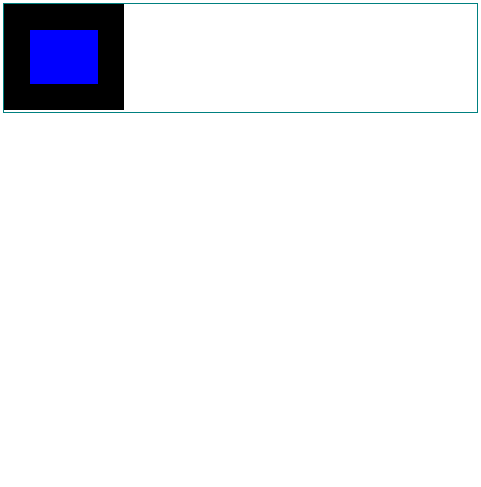
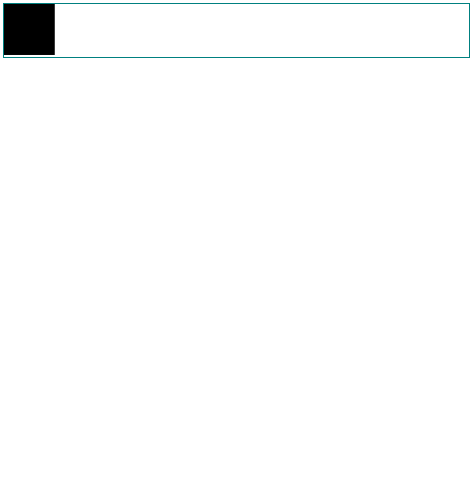

# Race Condition when Running Reference Test in Chrome

When a [Web Platform Test](https://github.com/w3c/web-platform-tests) reference
test is requested, [the `wptrunner` tool](https://github.com/w3c/wptrunner)
performs the following actions:

1. Navigates to the document via the "go" command
2. Injects [a "wait"
   script](https://github.com/w3c/wptrunner/blob/38435bc6714ae83bbf759b04395fe13f08388396/wptrunner/executors/reftest-wait_webdriver.js)
   via the "execute async script" command
3. Captures the state of the screen using the "screenshot" command

([source](https://github.com/w3c/wptrunner/blob/38435bc6714ae83bbf759b04395fe13f08388396/wptrunner/executors/executorselenium.py#L253-L264))

(Note: Although the "wait" script in step 2 is authored to defer until the
document's `readyState` is `"ready"`, the delay introduced by the "HTTP
command" protocol means that practically speaking, this event always occurs
prior to the evaluation of the script. In other words, the "wait" script always
signals completion synchronously.)

Despite this, external image resources are not always rendered when the
screenshot is captured in step 3.

This project demonstrates the problem in a simplified environment.

## To Run

1. Install the following system dependencies:
   - Python 2.7
   - [The PIP tool](https://pip.pypa.io/en/stable/installing/) for installing
     Python packages
   - Google Chrome
   - the Chromedriver binary

2. Install the Python dependencies using the following command:

        $ pip install -r requirements.txt

3. Run the Chromedriver binary, bound to port 4444:

        $ chromedriver --port=4444

4. Run the `main.py` Python script located in the root of this project:

        $ python main.py

   The script navigates to the same simple document, capturing a screen shot
   after each navigation. It halts when any two screenshots do not match,
   ending by saving the screenshots to a file named `results.html`.

## Analysis

The following images are examples of screenshots captured when running this
script on an Ubuntu 16.04 x64 system:

While it appears that in the second screenshot, the image failed to load at
all, a few details indicate that the document is in some transitional state:

- The value of the `documentElement`'s `scrollHeight` property reflects the
  height of the document with a fully-rendered image. This is true even when
  the `clientHeight` value is captured *before* the screenshot.
- If another screenshot is captured after an arbitrary delay, the image is
  rendered as expected

Because this behavior is somewhat counter-intuitive, and because this is not
exhibited by Firefox, I am reaching out to the Chromium development team for
insight about the internals of the engine and how this indeterminacy might be
avoided.

## License

Copyright 2017 Mike Pennisi under [the GNU General Public License
v3.0](https://www.gnu.org/licenses/gpl-3.0.html)
